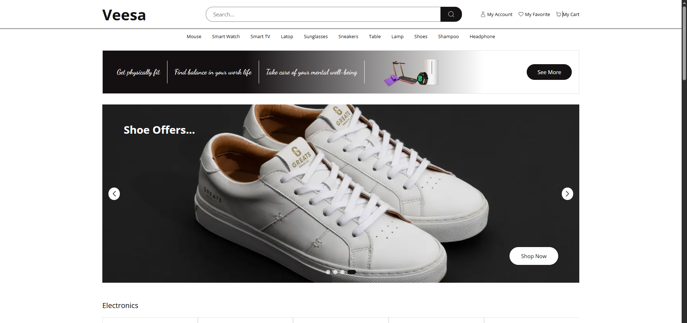
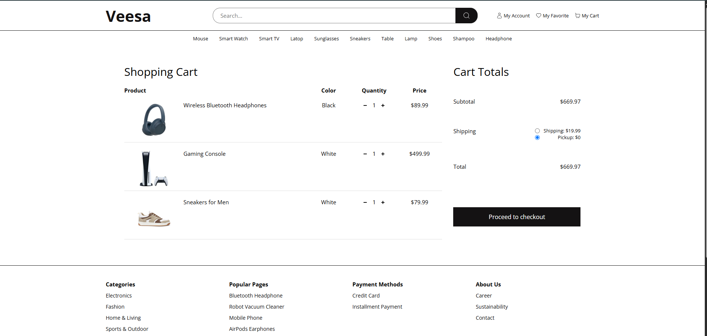
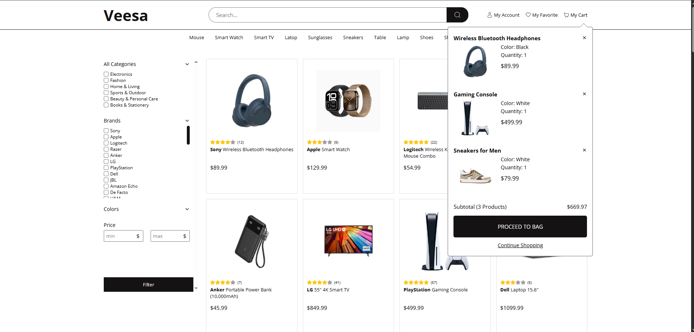
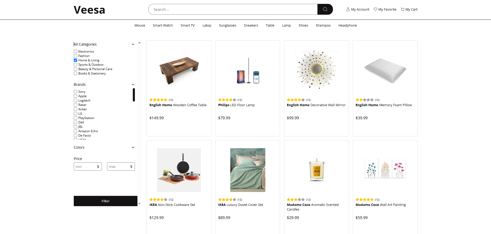

# 🛍️ Vessa E-Commerce

**Vessa** is a modern and responsive e-commerce web application where users can browse products, filter them by category, view detailed information, and manage their shopping cart using fake data.

## 🖼️ Screenshots





---

## 🚀 Features

- 🔎 Filter products by category/type
- 📄 View product details
- 🛒 Add to cart and manage selected items
- 🧮 See total price dynamically
- 📱 Fully responsive for all devices
- 📂 Uses local fake data (JSON-based)
- ⚡ Clean and fast user experience

---

## 🛠️ Built With

- [React.js]
- [React Router]
- [Redux Toolkit]
- [SCSS]
- [JavaScript (ES6+)]
- Fake JSON data (local file for mocking content)

---

## 📦 Getting Started

To run this project locally:

```bash
# Clone the repository
git clone https://github.com/KKocbeler/vessa-e-commerce.git

# Go to the project folder
cd vessa-e-commerce

# Install dependencies
npm install

# Start the development server
npm run dev

## 📫 Contact
Email: kkocbeler@gmail.com
LinkedIn: Kemal Koçbeler
